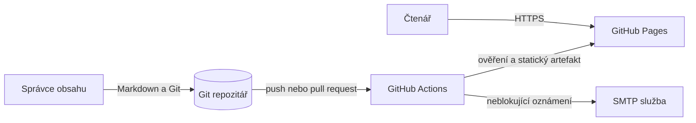
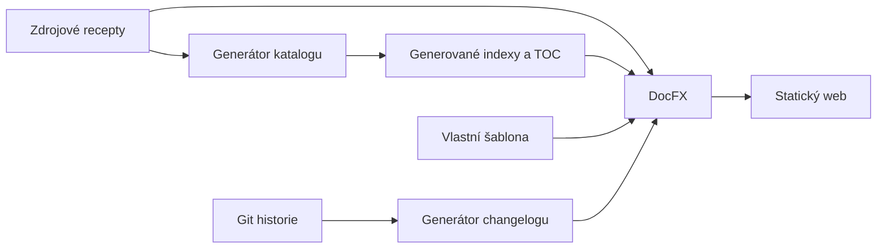

# Architektura systému

Tento dokument je jediným kanonickým popisem architektury projektu.

Funkční význam systému je definovaný v [`../product/requirements.md`](../product/requirements.md).

Důvody významných voleb jsou zaznamenané v [`decisions/`](decisions/README.md).

## Stav architektonických tvrzení

**Skutečnost k 2026-08-28:** Projekt je statický dokumentační web sestavovaný z Markdownu jedním Node.js generátorem a DocFX.

**Záměr:** Zachovat jednoduchou statickou architekturu, deterministické generování a jediný autoritativní zdroj obsahu bez databáze a aplikačního serveru.

**Přechody:** Technické přechody uvnitř repozitáře jsou uzavřené, ale externí ochrana větví zůstává neaktivní podle části [Zbytková rizika a trvalé kontroly](#11-zbytková-rizika-a-trvalé-kontroly).

## 1. Účel architektury a kvalitativní cíle

| Priorita | Kvalitativní cíl | Navázaný požadavek | Jak architektura podporuje ověření |
|---|---|---|---|
| 1 | Reprodukovatelné sestavení | `QLT-001` | npm lockfile, lokální manifest DocFX a společné npm vstupy pro lokální prostředí i CI |
| 2 | Konzistentní katalog a navigace | `REQ-003`, `QLT-002` | Jediný generátor odvozuje všechny přehledy a TOC přímo ze zdrojových položek |
| 3 | Rychlý veřejný přístup | `REQ-001`, `REQ-002` | Předem vytvořený statický web bez runtime databáze nebo serverové aplikace |
| 4 | Bezpečné publikování | `REQ-004`, `QLT-004` | Čtecí ověřovací job je oddělený od zapisovacího publikačního jobu a jeho tajemství |

## 2. Omezení

| Omezení | Původ | Dopad | Stav |
|---|---|---|---|
| Obsah je Markdown v adresářové struktuře `food/` a `drink/` | Historie projektu a `REQ-003` | Cesta souboru určuje sekci, původ a typ položky | Záměr |
| Výstup je veřejný český web | Produktové požadavky | Interní a citlivé materiály nesmějí vstoupit do DocFX content globu | Záměr |
| Hosting používá GitHub Pages | Remote, workflow a veřejná URL | Publikování závisí na GitHub Actions a větvi spravované nasazovací akcí | Skutečnost |
| Oznámení používá SMTP třetí strany | Workflow | Selhání oznámení musí zůstat oddělené od dostupnosti webu | Skutečnost |
| Web nemá runtime úložiště ani autentizaci | Repozitář a veřejný smoke | Veškerý stav vzniká před publikováním | Skutečnost a záměr |

## 3. Kontext a hranice systému

Diagram ukazuje vývojový a publikační kontext, nikoli vnitřní kroky generátoru.

| Aktér nebo systém | Směr komunikace | Účel | Rozhraní | Vlastník | Selhání a náhrada |
|---|---|---|---|---|---|
| Správce obsahu | Do systému | Přidává a opravuje obsah | Git a Markdown | Maintainers | Změna se nepublikuje, dokud neprojde kontrolami |
| Čtenář | Ze systému | Prochází a čte kuchařku | Veřejné HTTPS | Uživatel webu | Neexistující cesta vrátí HTTP 404 |
| GitHub | Obousměrně | Uchovává Git, spouští CI a hostuje Pages | Git, Actions a Pages | GitHub | Lokální build zůstává reprodukční cestou, publikování čeká na obnovu platformy |
| npm registry | Do sestavení | Obnovuje uzamčený changelog nástroj | HTTPS balíčkový registr | npm | Existující cache může pomoci, ale první čistá obnova vyžaduje síť |
| NuGet.org | Do sestavení | Obnovuje připnutý DocFX | HTTPS balíčkový registr | NuGet a DocFX | Bez nástroje nelze sestavit nový artefakt, již publikovaný web zůstává dostupný |
| SMTP služba | Ze systému | Odesílá informaci o změnách | TLS SMTP prostřednictvím GitHub Action | Poskytovatel pošty | Krok je neblokující a diagnostikuje se samostatně |

## 4. Strategie řešení

- Zdrojové recepty jsou autoritativní a přehledy jsou jejich odstranitelná projekce.
- Generátor používá pouze standardní knihovnu Node.js a synchronní I/O vhodné pro krátký jednorázový build.
- DocFX převádí omezený produktový obsah do statického webu a interní projektovou dokumentaci nezahrnuje do veřejného artefaktu.
- Lokální prostředí i CI volají stejné skripty z [`../development/commands.md`](../development/commands.md).
- Publikování probíhá až po samostatném ověření a sestavení bez varování.

## 5. Stavební bloky a pravidla závislostí

Diagram ukazuje jednosměrné odvozování výstupů a odděluje obsahovou a změnovou větev sestavení.

| Blok | Odpovědnost | Veřejná hranice | Povolené závislosti | Vlastník dat |
|---|---|---|---|---|
| Zdrojový obsah | Definuje recept nebo nápoj | Markdown soubor v podporované cestě | Žádná generovaná stránka | Správce obsahu |
| `scripts/generate-docs.js` | Normalizuje obsah a sestavuje katalog, přehledy a TOC | npm skripty `docs:generate` a `docs:check` | Node.js standardní knihovna a zdrojový obsah | Engineering |
| Generované přehledy | Poskytují odvozenou navigaci a katalog | `index.md` a `toc.yml` v produktovém stromu | Pouze generátor | Generátor |
| Changelog | Odvozuje kategorizovaný veřejný přehled změn z historie | `cliff.toml` a npm skript | Git historie a `git-cliff` uzamčený npm lockfilem; výstup je ignorovaný build vstup | Delivery |
| DocFX sestavení | Čistí starý výstup a převádí produktový Markdown a YAML do HTML a indexu hledání | `docs:clean`, `docfx.json` a lokální .NET tool manifest | Obsah, přehledy, changelog a šablona | Engineering |
| Vlastní šablona | Přizpůsobuje vzhled, české popisky a klientské vstupy moderního tématu | `templates/kitchen/` | Podporované veřejné assety a tokeny šablony DocFX | Design a engineering |
| Klientské hledání | Normalizuje libovolné české nebo anglické termíny, porovnává je s `index.json` a vrací výsledky rendereru DocFX | `templates/kitchen/public/search-core.mjs` a workerový kontrakt DocFX | Standardní webová API a statický index vytvořený DocFX | Engineering |
| GitHub workflow | Ověřuje, sestavuje, publikuje a oznamuje | `.github/workflows/main.yml` | Projektové příkazy, GitHub Actions, Pages a SMTP | Delivery |

Závislosti tečou pouze směrem ke generovanému výstupu a zdrojový obsah nikdy nezávisí na `_site/`.

## 6. Klíčové běhové scénáře

| Scénář | Navázaný požadavek | Konzistenční hranice | Selhání a zotavení |
|---|---|---|---|
| Lokální změna obsahu | `REQ-003`, `REQ-E001`, `REQ-E002` | Jedno spuštění generátoru nejprve načte a ověří celý katalog a poté zapisuje odvozené soubory | Chyba vypíše soubor a ukončí proces nenulově, správce opraví zdroj a spustí kontrolu znovu |
| Ověření změny | `QLT-001`, `QLT-002` | `npm test` ověřuje nulový rozdíl generátoru a strukturu repozitáře | Pull request ani větev se nesmějí publikovat při selhání |
| Publikování `main` | `REQ-004` | Jeden publikační job v dočasném workspace vygeneruje changelog, sestaví `_site/` a nasadí tentýž artefakt bez změny `main` | Selhání před nasazením zachová předchozí web, po opravě lze workflow bezpečně zopakovat |
| Čtení receptu | `REQ-001`, `REQ-002` | Jedna verze statických souborů na GitHub Pages | Chybějící cesta vrátí 404 a správce ověří zdroj, TOC a nasazený commit |
| Hledání | `REQ-005` | Worker jednou připraví statický `index.json` a každý dotaz vyžaduje shodu všech normalizovaných slov | Dotaz bez shody zobrazí českou nulovou informaci a klientská chyba se diagnostikuje konzolí a smoke scénářem |
| Oznámení | `REQ-E004` | E-mail následuje až po nasazení | SMTP chyba nezmění výsledek nasazení a zůstane v logu Actions |

## 7. Data a jejich životní cyklus

| Datová oblast | Autoritativní zdroj | Vlastník | Konzistence | Retence a mazání | Migrace |
|---|---|---|---|---|---|
| Recepty a nápoje | Verzované Markdown soubory pod `food/` a `drink/` | Správce obsahu | Git commit | Git historie podle repozitáře, odstranění přes běžnou změnu | Přesuny cest musí aktualizovat nebo přesměrovat veřejné odkazy |
| Katalog a navigace | Generátor a zdrojový obsah | Generátor | Přepočet při každé změně | Výstupy lze odstranit a znovu vytvořit | Změna struktury vyžaduje kompatibilní úpravu parseru cest |
| Changelog | Git historie a `cliff.toml` | Delivery | Regenerace při každém sestavení | Ignorovaný lokální výstup a kopie ve statickém artefaktu | Změna formátu nesmí skrýt dosažitelný commit |
| Statický web | `_site/` vytvořený z jednoho checkoutu | Build | Neměnný artefakt jednoho běhu | Lokálně ignorovaný, publikovaná kopie se nahrazuje nasazením | Nová verze se nasazuje bez runtime datové migrace |
| Tajemství CI | GitHub Actions secrets | Maintainers | Mimo repozitář | Rotace podle správy účtu | Přesun poskytovatele vyžaduje nové řízené identity |

Projekt neukládá čtenářská data, účty, cookies aplikace ani produkční databázi.

## 8. Nasazení a provozní topologie

| Prostředí | Běhové jednotky | Stav | Síťová hranice | Škálování | Pozorovatelnost |
|---|---|---|---|---|---|
| Lokální vývoj | Node.js generátor, lokální DocFX a statický server | Zdrojový checkout a odstranitelný `_site/` | npm a NuGet pouze při obnově nástrojů | Není potřeba | Výstup příkazů, HTTP a konzole prohlížeče |
| GitHub Actions | Oddělený ověřovací a publikační job | Dočasný checkout a cache závislostí | Registry, GitHub, Pages a SMTP | Spravuje GitHub | Logy jednotlivých kroků |
| GitHub Pages | Statické HTML, CSS, JavaScript a JSON | Bez serverového stavu projektu | Veřejné HTTPS | Spravuje GitHub Pages | HTTP dostupnost a klientská konzole |

Přesné kroky nasazení jsou v [`../delivery/ci-cd.md`](../delivery/ci-cd.md) a zásahy při selhání v [`../operations/runbook.md`](../operations/runbook.md).

## 9. Průřezové koncepty

| Koncept | Kanonický princip | Vynucení | Výjimky |
|---|---|---|---|
| Cesty obsahu | Sekce, oblast, země a typ mají stabilní segmenty definované generátorem | Parser cest a strukturální kontrola | Univerzální jídla nemají zemi |
| Lokalizace | Obsah, navigace, popisky šablony a HTML jazyk jsou české, zatímco hledání zpracuje české i anglické termíny z indexu | Zdrojový Markdown, `token.json`, `_lang` a jazykově nezávislá normalizace Unicode | Skloňování, stemming, překlad, synonyma a tolerance překlepů zůstávají mimo rozsah |
| Determinismus | Stejný zdroj a verze nástrojů vytvářejí stejný katalog a web | Lockfile, tool manifest a režim `--check` | Changelog se mění s Git historií |
| Konfigurace | Strojové volby zůstávají v manifestech a workflow | `package.json`, `.config/dotnet-tools.json`, `docfx.json` a workflow | Význam a použití vysvětlují kanonické dokumenty |
| Chyby | Vadný zdroj zastaví ověření před publikováním | Nenulové exit kódy a závislost publikačního jobu na ověření | E-mailové oznámení je záměrně neblokující |

## 10. Bezpečnost a ochrana dat

| Aktivum nebo hranice | Hrozba | Opatření | Zbytkové riziko | Ověření |
|---|---|---|---|---|
| Veřejný obsah | Nechtěné zveřejnění soukromého souboru | DocFX používá explicitní produktové globs a review změny | Správce může vložit citlivý text přímo do receptu | Kontrola diffu a výsledného artefaktu |
| Pull request a `develop` | Zneužití zapisovacího tokenu nebo tajemství | Ověřovací job má pouze `contents: read`, bez SMTP secrets a s akcemi připnutými na SHA | Připnutá revize externí akce stále vykonává kód třetí strany | Automatická strukturální kontrola a review změn SHA |
| Publikační job | Změna `main` nebo nasazené větve | `contents: write` má pouze job po úspěšném ověření a workflow do `main` nezapisuje | Externí nasazovací akce zpracovává krátkodobý token | Připnuté SHA, oddělený job a kontrola oprávnění |
| SMTP přihlašovací údaje | Únik tajemství do logu nebo artefaktu | Hodnoty jsou pouze v GitHub Secrets a předávají se jednomu kroku | Akce třetí strany tajemství zpracovává | Review akce, logů a rotace při incidentu |
| Čtenář | Sledování nebo únik osobních dat | Projekt nemá účet, serverovou telemetrii ani vlastní cookies | Hosting může používat vlastní provozní logy podle podmínek GitHubu | Revize produktu a hostingu při změně rozsahu |

## 11. Zbytková rizika a trvalé kontroly

Technické přechody původně vedené jako `ARCH-RISK-001` a `ARCH-RISK-005` uzavřelo přijaté [`ADR-0002`](decisions/ADR-0002-vyhledavani-nad-docfx-indexem.md), automatické scénáře a ověřený upgrade DocFX.

| ID | Skutečnost | Dopad | Povinná kontrola nebo cílový stav | Vlastník | Podmínka změny nebo přezkoumání |
|---|---|---|---|---|---|
| `CONTENT-CONTROL-001` | Technické kontroly neumějí spolehlivě posoudit kulinářskou správnost ingrediencí, množství a postupu | Věcná chyba může projít sestavením | Každou věcnou obsahovou změnu potvrdí člověk znalý receptu | Správce obsahu | Při změně produktového modelu nebo zavedení odborného validačního zdroje |
| `DELIVERY-RISK-001` | Veřejné GitHub API dne 2026-08-28 uvedlo `protected: false` pro `main` i `develop` | Přímý push nemusí projít pull requestem ani schválením, přestože následný workflow stále ověřuje commit | Maintainer výslovně rozhodne o pravidlech a případnou branch protection nastaví mimo repozitář | Maintainers | Ověřená ochrana vhodných větví nebo zdokumentované přijetí přímých pushů |

## 12. Architektonický slovník

| Termín | Kanonický technický význam |
|---|---|
| Zdrojový obsah | Ručně udržovaný Markdown receptu nebo nápoje |
| Generovaný přehled | Odstranitelný Markdown nebo YAML soubor vytvořený `scripts/generate-docs.js` |
| Produktový docset | Soubory explicitně zahrnuté v `docfx.json`, které smějí vstoupit do veřejného webu |
| Statický artefakt | Obsah `_site/` vytvořený DocFX z jednoho zdrojového stavu |
| Ověřovací job | CI job bez zapisovacího tokenu a publikačních tajemství |
| Publikační job | CI job pro `main`, který v dočasném workspace vytvoří changelog, nasadí artefakt a odešle oznámení bez změny zdrojové větve |

## Pravidlo aktualizace

Tento dokument se aktualizuje ve stejné změně jako zásah do hranic bloků, toku dat, běhových scénářů, nasazení, bezpečnosti, veřejného rozhraní nebo významného kvalitativního opatření.
