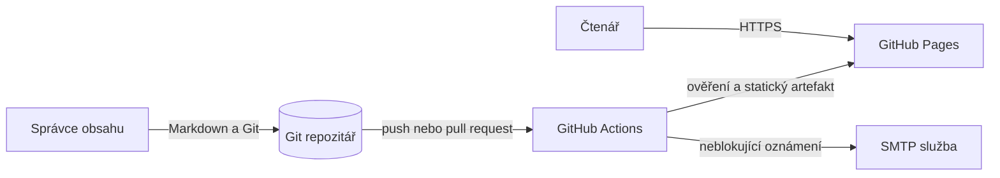
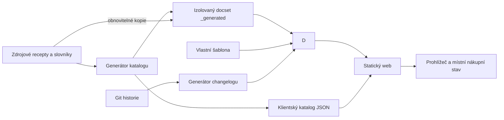

# Architektura systému

Tento dokument je jediným kanonickým popisem architektury projektu.

Funkční význam systému je definovaný v [`../product/requirements.md`](../product/requirements.md).

Důvody významných voleb jsou zaznamenané v [`decisions/`](decisions/README.md).

## Stav architektonických tvrzení

**Skutečnost k 2026-09-13:** Projekt je statická dokumentace života sestavovaná z Markdownu Node.js generátorem a DocFX, se současnou oblastí jídla a pití a klientským výběrem jídel, nákupem a režimem vaření.

**Záměr:** Zachovat jednoduchou statickou architekturu, deterministické generování a jediný autoritativní zdroj obsahu bez databáze a aplikačního serveru.

**Přechody:** V dotčené architektuře nejsou otevřené technické přechody a ochranu zdrojových větví vynucují GitHub rulesety popsané v [`../delivery/ci-cd.md`](../delivery/ci-cd.md#ochrana-větví).

## 1. Účel architektury a kvalitativní cíle

| Priorita | Kvalitativní cíl | Navázaný požadavek | Jak architektura podporuje ověření |
|---|---|---|---|
| 1 | Reprodukovatelné sestavení | `QLT-001` | npm lockfile, lokální manifest DocFX a společné npm vstupy pro lokální prostředí i CI |
| 2 | Konzistentní katalog a navigace | `REQ-003`, `QLT-002` | Jediný generátor odvozuje všechny přehledy a TOC přímo ze zdrojových položek |
| 3 | Rychlý veřejný přístup | `REQ-001`, `REQ-002` | Předem vytvořený statický web bez runtime databáze nebo serverové aplikace |
| 4 | Bezpečné publikování | `REQ-004`, `QLT-004` | Čtecí ověřovací job je oddělený od zapisovacího publikačního jobu a jeho tajemství |

## 2. Omezení

| Omezení | Původ | Dopad | Stav |
|---|---|---|---|
| Receptový obsah je Markdown v adresářové struktuře `food/` a `drink/` | Historie projektu a `REQ-003` | Cesta souboru určuje sekci, původ a typ receptu, obecné návody jsou samostatné docset vstupy | Záměr |
| Výstup je veřejný český web | Produktové požadavky | Interní a citlivé materiály nesmějí vstoupit do DocFX content globu | Záměr |
| Hosting používá GitHub Pages | Remote, workflow a veřejná URL | Publikování závisí na GitHub Actions a větvi spravované nasazovací akcí | Skutečnost |
| Oznámení používá SMTP třetí strany | Workflow | Selhání oznámení musí zůstat oddělené od dostupnosti webu | Skutečnost |
| Web nemá serverové úložiště ani autentizaci | Repozitář a lokální smoke | Čtenářský výběr žije pouze v místním úložišti prohlížeče | Skutečnost a záměr |

## 3. Kontext a hranice systému

Diagram ukazuje vývojový a publikační kontext, nikoli vnitřní kroky generátoru.

| Aktér nebo systém | Směr komunikace | Účel | Rozhraní | Vlastník | Selhání a náhrada |
|---|---|---|---|---|---|
| Správce obsahu | Do systému | Přidává a opravuje obsah | Git a Markdown | Maintainers | Změna se nepublikuje, dokud neprojde kontrolami |
| Čtenář | Ze systému | Prochází a čte životní návody | Veřejné HTTPS | Uživatel webu | Neexistující cesta vrátí HTTP 404 |
| GitHub | Obousměrně | Uchovává Git, spouští CI a hostuje Pages | Git, Actions a Pages | GitHub | Lokální build zůstává reprodukční cestou, publikování čeká na obnovu platformy |
| npm registry | Do sestavení | Obnovuje uzamčený changelog nástroj | HTTPS balíčkový registr | npm | Existující cache může pomoci, ale první čistá obnova vyžaduje síť |
| NuGet.org | Do sestavení | Obnovuje připnutý DocFX | HTTPS balíčkový registr | NuGet a DocFX | Bez nástroje nelze sestavit nový artefakt, již publikovaný web zůstává dostupný |
| SMTP služba | Ze systému | Odesílá informaci o změnách | TLS SMTP prostřednictvím GitHub Action | Poskytovatel pošty | Krok je neblokující a diagnostikuje se samostatně |

## 4. Strategie řešení

- Zdrojové recepty jsou autoritativní a přehledy jsou jejich odstranitelná projekce.
- Obsahový generátor používá standardní knihovnu Node.js a synchronní I/O, historii odvozuje již přijatý `git-cliff`.
- DocFX převádí omezený produktový obsah do statického webu a interní projektovou dokumentaci nezahrnuje do veřejného artefaktu.
- Lokální prostředí i CI volají stejné skripty z [`../development/commands.md`](../development/commands.md).
- Publikování probíhá až po samostatném ověření a sestavení bez chyb, upozornění na chybějící množství mají přijatý neblokující význam podle [receptového kontraktu](../product/recipe-format.md#automatická-kontrola-obsahu).

## 5. Stavební bloky a pravidla závislostí

Diagram ukazuje jednosměrné odvozování výstupů a odděluje obsahovou a změnovou větev sestavení.

| Blok | Odpovědnost | Veřejná hranice | Povolené závislosti | Vlastník dat |
|---|---|---|---|---|
| Zdrojový obsah | Definuje recept nebo nápoj | Markdown soubor v podporované cestě | Žádná generovaná stránka | Správce obsahu |
| `scripts/generate-docs.js` | Ověří celý obsah a poté sestaví katalog, přehledy, TOC, changelog a klientská data bez změn receptů | npm skripty `docs:generate` a `docs:check` | Node.js, zdrojový obsah, slovníky a `git-cliff` | Engineering |
| `scripts/docset/` | Odděluje taxonomii, čtení katalogu, vykreslení přehledů a synchronizaci výstupů | `taxonomy.cjs`, `catalog.cjs`, `pages.cjs`, `output.cjs` | CLI skládá moduly, diagnostika a kolekce souborů patří jedinému běhu | Engineering |
| Parser receptů | Ověřuje tabulky, kanonické názvy, stabilní identifikátory a navazující kroky | `scripts/recipe-content.cjs` | Zdrojové recepty a `data/ingredients.json` | Engineering |
| Klientská kuchařka | Řídí výběr, nákup a vaření | `templates/kitchen/public/kitchen.mjs` | DOM, standardní webová API, `kitchen-core.mjs` a generovaný `data/recipes.json` | Engineering |
| Doménové jádro nákupu | Slučuje množství a validuje lokální stav | `templates/kitchen/public/kitchen-core.mjs` | Pouze standardní JavaScript | Engineering |
| Přenos nákupu | Ověřuje sdílenou kopii a připravuje výslovné řešení konfliktů | `templates/kitchen/public/kitchen-transfer.mjs` | Doménové jádro, aktuální katalog a standardní kompresní API prohlížeče | Čtenář a zvolený příjemce |
| PDF export | Převádí aktuální exportní náhled na stránkovaný soubor | `templates/kitchen/public/kitchen-pdf.mjs` | DOM náhledu a odloženě načtené lokální assety pdfmake podle [ADR-0005](decisions/ADR-0005-pdf-export-v-prohlizeci.md) | Engineering |
| Generovaný docset | Obsahuje odvozenou navigaci, katalog a kopie veřejného Markdownu | Ignorovaný `_generated/`, jeho manifest a `docfx.json` | Pouze ruční zdroje a generátor | Generátor |
| Changelog | Odvozuje veřejný přehled úplné historie po ročních obdobích a uvnitř zachovává kategorie | `cliff.toml` a npm skript | Git historie a `git-cliff` uzamčený npm lockfilem, výstup je ignorovaný build vstup | Delivery |
| DocFX sestavení | Čistí starý výstup a převádí produktový Markdown a YAML do HTML a indexu hledání | `docs:clean`, `docfx.json` a lokální .NET tool manifest | Obsah, přehledy, changelog a šablona | Engineering |
| Vlastní šablona | Přizpůsobuje vzhled, české popisky a klientské vstupy moderního tématu a ponechává příspěvkový blok DocFX vypnutý | `templates/kitchen/` a `docfx.json` | Podporované veřejné assety, tokeny a globální metadata DocFX | Design a engineering |
| Klientské hledání | Normalizuje libovolné české nebo anglické termíny, porovnává je s `index.json` a vrací výsledky rendereru DocFX | `templates/kitchen/public/search-core.mjs` a workerový kontrakt DocFX | Standardní webová API a statický index vytvořený DocFX | Engineering |
| GitHub workflow | Ověřuje, sestavuje, publikuje a oznamuje | `.github/workflows/main.yml` | Projektové příkazy, GitHub Actions, Pages a SMTP | Delivery |

Závislosti tečou pouze směrem ke generovanému výstupu a zdrojový obsah nikdy nezávisí na `_site/`.

### Obecné návody a další oblasti

Obecný Úvod obsahuje dostupné oblasti života a orientaci v celém webu.

Neobsahuje katalog ani kuchařské rozšíření.

Generovaná `kuchyne/index.md` přebírá katalog a kuchařské rychlé cesty.

Její TOC zahrnuje existující Jídlo, Nápoje a Můj nákup podporovaným vnořením TOC v DocFX.

Starý klientský odkaz na úvod s `#recepty` nebo katalogovými filtry přejde do Kuchyně a zachová dotaz.

Adresy receptů a nákupní stránka zůstávají původní.

Veřejný `pruvodce.md` je ručně udržovaný obecný návod, jehož kopii generátor výslovně připravuje do veřejného docsetu.

Neparsuje jej jako recept ani nepřepisuje jeho zdroj.

Klientské kuchařské rozšíření načítá receptový JSON pouze pro katalog, nákup a stromy `food/` a `drink/`.

Ostatní stránky používají společnou navigaci, motiv a fulltext bez nákupní lišty a receptového editoru.

Nová skutečná obsahová oblast dostane vlastní adresář mimo receptové stromy, explicitní výběr zdrojů v generátoru docsetu a odkaz v generátoru úvodu a kořenového TOC.

Její obsahový kontrakt se určí podle konkrétního použití.

Prázdné kategorie, univerzální schéma kroků ani další aplikační framework se předem nezavádějí.

Interní `docs/` a `private/` se kvůli novému tématu nesmějí plošně přidat do veřejného docsetu.

Receptová validace se rozhoduje podle explicitně vybraných receptových zdrojů, nikoli podle přítomnosti slova ingredience nebo hodnoty `neuvedeno` v libovolné stránce.

## 6. Klíčové běhové scénáře

| Scénář | Navázaný požadavek | Konzistenční hranice | Selhání a zotavení |
|---|---|---|---|
| Lokální změna obsahu | `REQ-003`, `REQ-E001`, `REQ-E002` | Jedno spuštění generátoru nejprve načte a ověří celý katalog a poté zapisuje odvozené soubory | Chyba vypíše soubor a ukončí proces nenulově, správce opraví zdroj a spustí kontrolu znovu |
| Ověření změny | `QLT-001`, `QLT-002` | `npm test` odvozuje výstupy z aktuálních zdrojů, ověřuje jejich determinismus a strukturu repozitáře | Pull request ani větev se nesmějí publikovat při selhání |
| Publikování `main` | `REQ-004` | Jeden publikační job ověří aktuální dosud nenasazenou revizi, v dočasném workspace vygeneruje changelog, sestaví `_site/` a nasadí tentýž artefakt bez změny `main` | Selhání před nasazením zachová předchozí web; opakování již nasazené revize přeskočí publikování i oznámení |
| Čtení receptu | `REQ-001`, `REQ-002` | Jedna verze statických souborů na GitHub Pages | Chybějící cesta vrátí 404 a správce ověří zdroj, TOC a nasazený commit |
| Hledání | `REQ-005` | Worker jednou připraví statický `index.json` a každý dotaz vyžaduje shodu všech normalizovaných slov | Dotaz bez shody zobrazí českou nulovou informaci a klientská chyba se diagnostikuje konzolí a smoke scénářem |
| Oznámení | `REQ-E004` | E-mail následuje až po nasazení | SMTP chyba nezmění výsledek nasazení a zůstane v logu Actions |

## 7. Data a jejich životní cyklus

| Datová oblast | Autoritativní zdroj | Vlastník | Konzistence | Retence a mazání | Migrace |
|---|---|---|---|---|---|
| Recepty a nápoje | Ruční verzované Markdown soubory pod `food/` a `drink/` | Správce obsahu | Git commit | Git historie podle repozitáře, odstranění přes běžnou změnu | Přesuny cest musí aktualizovat nebo přesměrovat veřejné odkazy |
| Katalog a navigace | Generátor a zdrojový obsah | Generátor | Přepočet při každé změně | Výstupy lze odstranit a znovu vytvořit | Změna struktury vyžaduje kompatibilní úpravu parseru cest |
| Changelog | Git historie, `cliff.toml` a současné veřejné články | Delivery | Regenerace při každém sestavení | Ignorovaný lokální výstup a kopie ve statickém artefaktu | Časová osa řadí všechny commity od nejnovějších, nejnovější rok zůstává otevřený, starší roky jsou sbalené a dostupné články mají přímé odkazy |
| Statický web | `_site/` vytvořený z jednoho checkoutu | Build | Neměnný artefakt jednoho běhu | Lokálně ignorovaný, publikovaná kopie se nahrazuje nasazením | Nová verze se nasazuje bez runtime datové migrace |
| Tajemství CI | GitHub Actions secrets | Maintainers | Mimo repozitář | Rotace podle správy účtu | Přesun poskytovatele vyžaduje nové řízené identity |

Projekt nemá účty, aplikační cookies, serverovou databázi ani vzdálené ukládání čtenářských dat.

Výběr, odškrtnutí, průběh vaření a dříve uložená vlastní množství se ukládají v prohlížeči pod verzovaným klíčem odděleným podle cesty webu.

Data lze odstranit novým nákupem nebo vymazáním dat prohlížeče.

Zobrazení nákupu a vaření přepíná klientská vrstva pomocí fragmentu URL.

Nákup používá `#nakup`, `#nakupovat` a `#uvarit`, detail `#ingredience` a `#uvarit`.

Původní kotvy postupu odkrývají jeho sekci a `#vareni` přímo otevře krokový dialog také z karty vybraného jídla, po zavření zůstane zobrazená sekce Uvařit.

Panely nákupu se při přepnutí pouze skryjí, aby zůstala zachovaná otevřená nastavení, filtry a rozbalené zdroje.

Receptové panely přeskupují existující HTML a synchronizují viditelnost odkazů obsahu článku.

Bez úspěšného klientského rozšíření zůstává úplný statický recept beze změny.

Uživatelem vyžádané předání nákupu doplňuje [ADR-0007](decisions/ADR-0007-prenos-nakupu-bez-serveru.md).

Příjemce získává samostatnou kopii a nevzniká serverová synchronizace.

Přenosový modul odvozuje kompaktní data z platného nákupu a na příjmu před jakoukoli změnou ověří formát, velikost i po rozbalení, známé recepty, přesné revize, nastavení a příslušnost surovin.

Podpisy nákupních položek se dopočítají z aktuálního katalogu.

Libovolné podpisy ani text receptů z importu nejsou zdrojem obsahu.

Prohlížeč vytvoří odkaz s kódem ve fragmentu a zpracuje jej bez síťového načítání importované adresy.

Po otevření náhledu odstraní kód z aktuální adresy stránky.

Kopie není šifrovaná ani odvolatelná.

Příjemce odkazu ji může dále předat a služba použitá pro zprávu ji může uchovat.

Přesná pravidla sloučení, nahrazení a vrácení vlastní [produktový kontrakt](../product/requirements.md#předání-nákupu), zatímco implementace a číselné limity přenosového formátu jsou kanonické v modulu.

Přesnou datovou hranici a rizika přijímá [ADR-0004](decisions/ADR-0004-nakup-a-vareni-nad-markdownem.md).

### Odvozená data a rozsah automatizace

Odvozování probíhá výhradně z ručních zdrojů do ignorovaného `_generated/` a odtud přes DocFX do ignorovaného `_site/` podle [ADR-0006](decisions/ADR-0006-izolovane-generovani-docsetu.md).

Přehledy, navigace, nákupní stránka, receptový JSON a changelog se již neudržují ani neverzují mezi ručními zdroji.

`_generated/manifest.json` označuje každý výstup jako odvozený soubor nebo kopii s cestou k ručnímu originálu a uvádí jeho SHA-256 i způsob regenerace.

Markdown přehledy a TOC mají komentář se zdrojem a příkazem obnovy.

Receptový JSON obsahuje `generatedFrom`, zatímco kopie receptů zachovávají obsah originálu s normalizovanými konci řádků.

Generátor připraví celý docset a changelog v paměti před prvním zápisem a odstraní nepotřebné soubory pouze uvnitř `_generated/`.

`createContentFiles()` zůstává vstupem pro přípravu obsahu bez Git historie a bez zápisu.

Renderer vrací novou kolekci souborů a synchronizace vlastní porovnání přesných bajtů, manifest a odstranění zastaralých výstupů.

`verify-site.cjs` samostatně ověřuje inventuru stránek, katalog a fulltext, veřejné odkazy, statické recepty, assety a hranici publikování.

Chybný recept, neznámé zařazení, duplicitní surovina nebo neúplná Git historie tak nezmění dosavadní výstupy.

Selhání samotného zápisu lze napravit opakováním generování.

Kontrolní režim stejným výpočtem porovná chybějící, změněné i nadbytečné soubory a nic nezapisuje ani nemaže.

Před každým sestavením se výstupy automaticky obnoví a ověří, takže čerstvý checkout nepotřebuje předem vytvořený katalog.

Hotový web se ověří proti manifestu docsetu a klientskému katalogu včetně odkazů, fulltextu, kroků a PDF assetů.

Obě prostředí proto odmítnou stejný neúplný artefakt.

DocFX mapuje `_generated/` na kořen webu, proto se veřejné cesty ani identifikátory receptů přesunem odvozených souborů nemění.

Interní dokumentace, ruční slovníky, manifest původu ani soukromé materiály nejsou veřejnými resource vstupy.

Stejně je neveřejný `_generated/content-report.json`, který deterministicky odvozuje neblokující diagnostiky.

CLI je vypíše i bez zápisu a v GitHub Actions k nim přidá anotace zdrojových řádků.

Závěrečná kontrola webu čte stejný report a po souhrnu DocFX vypíše počet obsahových varování.

Obsahová diagnostika nevstupuje do interního počítadla DocFX, jehož vlastní varování nadále blokují sestavení.

| Údaj | Jediný zdroj | Automatické odvození a kontrola |
|---|---|---|
| Název, popis, suroviny, skupiny a kroky receptu | Markdown konkrétního receptu | Parser nejprve ověří celou sbírku a teprve potom generátor zapíše výstupy |
| Názvy surovin a oddělení obchodu | `data/ingredients.json` | Parser odmítá neznámé názvy i duplicity mezi odděleními, klient slučuje pouze stejný produkt se slučitelnou jednotkou |
| Počty, odkazy, typy, původ a veřejné přehledy | Cesty a obsah receptů, české názvy a příslušnost zemí v `data/taxonomy.json` | Generované Markdown seznamy, karty a TOC kontroluje `docs:check` |
| Příprava předem | První odstavec `## Než začnete` | Katalog přebírá text bez odhadování času |
| Revize receptu | Celý Markdown s normalizovanými konci řádků a oříznutými okraji | SHA-256 se ukládá do `_generated/data/recipes.json` a rozvařeného stavu, neshodná či chybějící revize zahodí pouze starý průběh |
| Receptový JSON | Stejné zdroje jako přehledy | `generatedFrom` popisuje původ, JSON se neupravuje ručně a je součástí deterministické kontroly |
| Changelog | Úplná Git historie a `cliff.toml` | Stávající uzamčený `git-cliff` běží v kontrolách, buildu i CI, není potřeba další generátor ani ruční přepis |
| Fulltext | Veřejné HTML vytvořené DocFX | DocFX sestaví index pro recepty i obecné návody, vlastní worker řeší normalizaci dotazu |

Nové vlastní množství klient nevytváří a nepoužívá filtr chybějících množství.

Pole `amounts` zůstává kompatibilní čtecí a přenosovou hranicí pro dříve uložená data podle [produktového kontraktu](../product/requirements.md#množství-v-nákupu).

Při každém uložení klient odstraňuje odškrtnutí a vlastní množství, jejichž podpis neodpovídá aktuálním zdrojům nákupu.

Editor ingrediencí používá stejný seznam a podpisy pro potvrzení přípravy jako společný nákup a nevytváří druhé úložiště odškrtnutí.

Před přidáním receptu odvozuje množství z výběru rozšířeného o jeho aktuální nastavení, první potvrzení pak uloží tento výběr i odpovídající podpis.

Uložení synchronizuje viditelné checkboxy všech otevřených editorů bez změny jejich rozbalení nebo fokusu.

První přechod ze starého stavu bez revize proto začne rozvařené recepty znovu, zatímco platné volby nákupu zachová.

Změny receptu a JSON se nasazují v jednom statickém artefaktu.

Nesoulad počtu vykreslených a datových kroků se přizná chybou a ponechá původní čitelný recept.

Počet porcí, chybějící množství, součet doby přípravy, výživa, alergeny a přepočty lžic na gramy se automaticky neodhadují, protože současné zdroje k nim nedávají spolehlivý podklad.

Klient přepočítává také autorem uvedené počty balení, sáčků, snítek, svazků a přílohových porcí, jejich hmotnost přitom zůstává neurčená, pokud ji zdroj neuvádí.

Databáze, CMS ani druhá ručně udržovaná reprezentace receptů nejsou potřeba.

Build kopie v izolovaném docsetu jsou plně obnovitelné.

Přesné uzamčené závislosti jsou zvláštní případ strojově vytvořeného vstupu: `package-lock.json` se commituje spolu s manifestem, protože určuje reprodukovatelnou obnovu nástrojů.

Kód v `templates/kitchen/` je ruční projektový zdroj i u názvu `search-worker.min.js`.

Převzaté licence a distribuční assety vlastní [politika závislostí](../development/dependencies.md).

## 8. Nasazení a provozní topologie

| Prostředí | Běhové jednotky | Stav | Síťová hranice | Škálování | Pozorovatelnost |
|---|---|---|---|---|---|
| Lokální vývoj | Node.js generátor, lokální DocFX a statický server | Zdrojový checkout a odstranitelný `_site/` | npm a NuGet pouze při obnově nástrojů | Není potřeba | Výstup příkazů, HTTP a konzole prohlížeče |
| GitHub Actions | Oddělený ověřovací a publikační job | Dočasný checkout a cache závislostí | Registry, GitHub, Pages a SMTP | Spravuje GitHub | Logy jednotlivých kroků |
| GitHub Pages | Statické HTML, CSS, JavaScript a JSON | Bez serverového stavu projektu | Veřejné HTTPS | Spravuje GitHub Pages | HTTP dostupnost a klientská konzole |

Přesné kroky nasazení jsou v [`../delivery/ci-cd.md`](../delivery/ci-cd.md) a zásahy při selhání v [`../operations/runbook.md`](../operations/runbook.md).

## 9. Průřezové koncepty

Vizuální orientaci podporují místní SVG assety generované z `data/icons.json` a taxonomie podle [ADR-0008](decisions/ADR-0008-lokalni-svg-ikony.md).

`scripts/generate-icons.cjs` zpracuje pouze vybrané ikony během přípravy docsetu.

`ui-icons.mjs` vytváří dekorativní značky v DOM bez vzdálené služby.

| Koncept | Kanonický princip | Vynucení | Výjimky |
|---|---|---|---|
| Cesty obsahu | Sekce, oblast, země a typ mají stabilní segmenty definované generátorem | Parser cest a strukturální kontrola | Univerzální jídla nemají zemi |
| Lokalizace | Obsah, navigace, popisky šablony a HTML jazyk jsou české, příspěvkový blok se negeneruje a hledání zpracuje české i anglické termíny z indexu | Zdrojový Markdown, `token.json`, `_lang`, `_disableContribution` a jazykově nezávislá normalizace Unicode | Skloňování, stemming, překlad, synonyma a tolerance překlepů zůstávají mimo rozsah |
| Determinismus | Stejný zdroj a verze nástrojů vytvářejí stejný docset a obsah webu | Lockfile, tool manifest a režim `--check` | Changelog se mění s Git historií |
| Konfigurace | Strojové volby zůstávají v manifestech a workflow | `package.json`, `.config/dotnet-tools.json`, `docfx.json` a workflow | Význam a použití vysvětlují kanonické dokumenty |
| Chyby | Vadný zdroj zastaví ověření před publikováním | Nenulové exit kódy a závislost publikačního jobu na ověření | E-mailové oznámení je záměrně neblokující |

## 10. Bezpečnost a ochrana dat

| Aktivum nebo hranice | Hrozba | Opatření | Zbytkové riziko | Ověření |
|---|---|---|---|---|
| Veřejný obsah | Nechtěné zveřejnění soukromého souboru | DocFX používá explicitní produktové globs a review změny | Správce může vložit citlivý text přímo do receptu | Kontrola diffu a výsledného artefaktu |
| Pull request a `develop` | Zneužití zapisovacího tokenu nebo tajemství | Ověřovací job má pouze `contents: read`, bez SMTP secrets a s akcemi připnutými na SHA | Připnutá revize externí akce stále vykonává kód třetí strany | Automatická strukturální kontrola a review změn SHA |
| Publikační job | Změna `main` nebo nasazené větve | `contents: write` má pouze job po úspěšném ověření a workflow do `main` nezapisuje | Externí nasazovací akce zpracovává krátkodobý token | Připnuté SHA, oddělený job a kontrola oprávnění |
| SMTP přihlašovací údaje | Únik tajemství do logu nebo artefaktu | Hodnoty jsou pouze v GitHub Secrets a předávají se jednomu kroku | Akce třetí strany tajemství zpracovává | Review akce, logů a rotace při incidentu |
| Čtenář | Sledování nebo nechtěné předání dat | Projekt nemá účet ani serverovou telemetrii, sdílený nákup předává čtenář výslovně zvolenému příjemci | Hosting má vlastní logy a příjemce či služba zpráv může kopii uchovat | Revize přenosové hranice, velikostní limity a náhled před importem |

## 11. Zbytková rizika a trvalé kontroly

| ID | Skutečnost | Dopad | Povinná kontrola nebo cílový stav | Vlastník | Podmínka změny nebo přezkoumání |
|---|---|---|---|---|---|
| `CONTENT-CONTROL-001` | Technické kontroly neumějí spolehlivě posoudit kulinářskou správnost ingrediencí, množství a postupu | Věcná chyba může projít sestavením | Každou věcnou obsahovou změnu potvrdí člověk znalý receptu, konkrétní nejasnosti vlastní [formát receptu](../product/recipe-format.md#obsahová-revize) | Správce obsahu | Při změně produktového modelu nebo zavedení odborného validačního zdroje |

## 12. Architektonický slovník

| Termín | Kanonický technický význam |
|---|---|
| Zdrojový obsah | Ručně udržovaný veřejný Markdown, recept nebo nápoj je jeho doménový typ |
| Generovaný přehled | Odstranitelný Markdown nebo YAML soubor vytvořený `scripts/generate-docs.js` |
| Produktový docset | Obnovitelný obsah `_generated/` vybraný generátorem z veřejných zdrojů a zahrnutý v `docfx.json` |
| Statický artefakt | Obsah `_site/` vytvořený DocFX z jednoho zdrojového stavu |
| Ověřovací job | CI job bez zapisovacího tokenu a publikačních tajemství |
| Publikační job | CI job pro `main`, který v dočasném workspace vytvoří changelog, nasadí artefakt a odešle oznámení bez změny zdrojové větve |

## Pravidlo aktualizace

Tento dokument se aktualizuje ve stejné změně jako zásah do hranic bloků, toku dat, běhových scénářů, nasazení, bezpečnosti, veřejného rozhraní nebo významného kvalitativního opatření.
