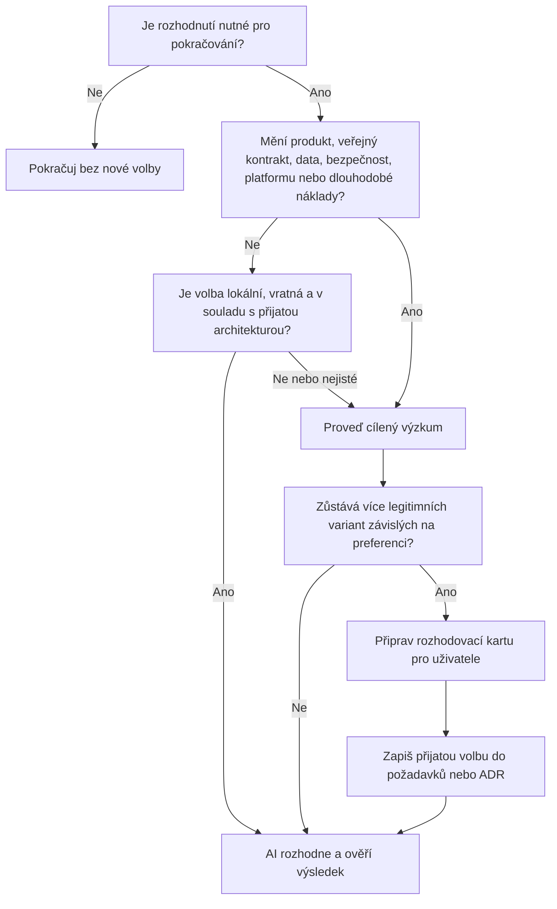

# Rozhodovací pravomoci AI a uživatele

## Cíl

AI má pracovat autonomně, pokud jsou produktové cíle a významná omezení známé.

Uživatel nemá být zatěžovaný volbami, které mají jednoznačně vhodné technické řešení.

Současně AI nesmí sama rozhodnout preference nebo závazky, které mění směr produktu či dlouhodobé vlastnosti projektu.

## Rozhodovací tok

Text tohoto dokumentu je kanonický.

Diagram pouze urychluje orientaci.

## Co AI rozhoduje samostatně

AI samostatně rozhoduje zejména tehdy, když je volba vratná, lokální a odvoditelná z přijatých pravidel.

- Umístění soukromého implementačního detailu v rámci existujících hranic.
- Pojmenování neveřejného prvku podle zavedených konvencí.
- Konkrétní refaktoring bez změny pozorovatelného chování.
- Volbu typu testu podle kanonické testovací strategie.
- Opravu zjevné chyby, která nevyžaduje novou produktovou interpretaci.
- Použití standardní funkce jazyka nebo již přijaté knihovny.
- Drobnou kompatibilní aktualizaci závislosti po požadovaném ověření.
- Interní strukturu implementace, pokud zachovává veřejný kontrakt a cílovou architekturu.
- Mechanické přizpůsobení CI zjištěné platformě podle existujícího projektu.

Rutinní rozhodnutí se nezapisuje do ADR.

Krátké odůvodnění se zapíše do pracovního záznamu pouze tehdy, když usnadní předání nebo vysvětlí neobvyklou volbu.

## Co rozhoduje uživatel

Uživatelské rozhodnutí je povinné, pokud zůstává více vhodných variant a volba závisí na cílech, preferenci nebo přijatelném riziku.

- Významné produktové chování, rozsah nebo uživatelský prožitek.
- Veřejné API, kompatibilita a strategie ukončení podpory.
- Změna významu, vlastnictví, retence nebo migrace dat.
- Bezpečnostní, soukromé, regulatorní nebo právní kompromisy.
- Zásadní technologický směr, platforma, poskytovatel nebo provozní model.
- Architektonická hranice s rozsáhlým dopadem na týmy nebo budoucí rozvoj.
- Rozhodnutí s vysokou cenou návratu, významným výpadkem nebo rizikem ztráty.
- Dlouhodobý náklad, vendor lock-in nebo provozní závazek.
- Volba mezi legitimními variantami, které optimalizují rozdílné cíle.

Pokud přijaté požadavky a omezení vyloučí všechny varianty kromě jedné, AI může tuto variantu doporučit a realizovat bez falešné volby.

Nejistota o záměru se nesmí vydávat za technický detail.

## Seskupení rozhodnutí před realizací

Před rozsáhlou realizací AI provede dostatečný průzkum, aby odhalila všechna aktuálně známá blokující rozhodnutí.

Rozhodnutí předloží společně v logickém pořadí a uvede, která pozdější volba závisí na dřívější.

Uživatel tak může schválit směr před dlouhou autonomní prací.

Nová otázka během realizace se otevře pouze tehdy, když ji nebylo možné rozumně zjistit dříve nebo ji vyvolal nový důkaz.

## Rozhodovací karta

Použij šablonu [`../templates/decision-request.md`](../templates/decision-request.md).

Karta musí být pochopitelná bez znalosti interních detailů.

Obsahuje nejvýše čtyři skutečně vhodné varianty.

Každá varianta uvádí jednoduchý význam, hlavní přínos, hlavní nevýhodu, dlouhodobý důsledek, migrační dopad a vratnost.

AI vždy doporučí jednu variantu a otevřeně vysvětlí, co by muselo platit, aby doporučila jinou.

Technické názvy nesmějí být jediným rozlišovacím prvkem.

Varianty pojmenuj podle výsledku pro projekt, například „nižší provozní složitost“ nebo „větší nezávislost na poskytovateli“.

## Záznam výsledku

Produktová volba aktualizuje [`../product/requirements.md`](../product/requirements.md).

Významná technická volba vytvoří ADR v [`../architecture/decisions/`](../architecture/decisions/README.md).

Rozhodnutí konkrétního úkolu bez trvalého významu zůstane pouze v dočasném pracovním záznamu.

Stejný výsledek se nepřepisuje do více míst.

Ostatní dokumenty na kanonický výsledek odkazují.

## Změna přijatého rozhodnutí

Při změně technického rozhodnutí použij životní cyklus definovaný v [`../architecture/decisions/README.md`](../architecture/decisions/README.md).

Pokud se současně mění pozorovatelné chování, aktualizuj jeho kanonický produktový požadavek.
