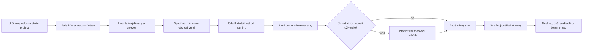

# Inicializace a důkladný průzkum projektu

## Účel

Tento postup se používá při založení nového projektu, převzetí existujícího projektu a před významnou změnou v dosud neprozkoumané oblasti.

Cílem není pouze popsat současný stav.

Cílem je získat důkazy, určit dlouhodobě správný záměr a vytvořit bezpečnou cestu mezi nimi.

Při prvním převzetí repozitáře proveď úplný základní průzkum projektu bez ohledu na velikost prvního požadavku.

Úplný základní průzkum lze přeskočit pouze tehdy, když jsou kanonické projektové dokumenty ve stavu `accepted`, jejich ověření je stále platné a žádný spouštěč revize nenastal.

Před každým dalším úkolem obnov průzkum v celém rozsahu dotčených toků, hranic a rizik.

Významná architektonická změna vyžaduje znovu celosystémový pohled.

Lokální oprava po platné inicializaci vyžaduje úplné pochopení dotčeného toku a jeho hranic, nikoli bezdůvodné opakování inventury každého souboru.

## Společný tok

Diagram ukazuje pořadí.

Podrobné požadavky jednotlivých fází jsou uvedené níže.

## 1. Bezpečný začátek

Nejdříve zjisti:

- kořen repozitáře a případné vnořené repozitáře,
- stav pracovního stromu a necommitované změny,
- aktuální větev, existenci `main` a `develop`,
- remotes, výchozí větev a hostingovou platformu,
- existující `AGENTS.md`, `CLAUDE.md` a další instrukční soubory,
- aktivní soubory `docs/work/WORK-*.md`,
- rozsah oprávnění a operací, které mohou mít vnější dopad.

Necommitované uživatelské změny nemaž, nepřepisuj ani automaticky neodkládej.

Větev připrav podle [`../development/workflow.md`](../development/workflow.md).

U složitého průzkumu založ pracovní záznam dříve, než začneš měnit stav projektu.

## 2. Zjištění hostingu a CI

Urči platformu kombinací vzdálených adresářů, konfiguračních souborů a projektových metadat.

Nepředpokládej GitHub pouze podle syntaxe YAML.

Zkontroluj zejména `.github/workflows`, `.forgejo/workflows`, `.gitea/workflows`, `.gitlab-ci.yml`, Azure Pipelines, Jenkins, Buildkite a další přítomné systémy.

Ověř, zda workflow skutečně používá aktuální hosting a zda není pouze historický.

Výsledek a kanonické cesty zapiš do [`../delivery/ci-cd.md`](../delivery/ci-cd.md).

## 3. Inventura projektu

Prozkoumej projekt shora dolů a poté po důležitých běhových tocích.

Nevycházej pouze z názvů adresářů.

Zaznamenej nebo ověř:

- jazyky, runtime, SDK a přesné verze,
- správce balíčků, manifesty, lockfily a lokální zdroje balíčků,
- vstupní body, sestavovací graf a generování kódu,
- moduly, jejich odpovědnosti a směr závislostí,
- veřejná API, schémata, protokoly a kompatibilitu,
- úložiště dat, migrace, vlastnictví a retenci,
- integrace a vnější služby,
- konfiguraci, tajemství a prostředí,
- testovací vrstvy a skutečně pokryté scénáře,
- CI, vydávání, nasazení a rollback,
- logování, metriky, trasování, health checks a provozní postupy,
- generovaný, vendored a třetími stranami vlastněný obsah,
- existující dokumentaci, ADR, issue odkazy a historické migrační plány.

Seznam souborů sám o sobě není architektonický průzkum.

Sleduj alespoň jeden hlavní úspěšný tok a jeden významný chybový tok od vstupu po pozorovatelný výsledek.

## 4. Nezměněná výchozí verze

Před vlastní implementací spusť dostupný projekt v jeho současném stavu.

Použij přesné příkazy z existujícího projektu a po ověření je kanonicky zapiš do [`../development/commands.md`](../development/commands.md).

Podle typu projektu ověř:

- obnovení nebo dostupnost závislostí,
- sestavení a statické kontroly,
- klíčové automatizované testy,
- spuštění aplikace nebo knihovny,
- jeden reprezentativní úspěšný scénář,
- jeden důležitý chybový scénář,
- stav CI, pokud jej lze bezpečně zjistit.

Výsledek zapiš do pracovního záznamu včetně přesného příkazu, prostředí, návratového kódu a důležitého výstupu.

Selhávající baseline neskrývej.

Rozliš závadu existující před úkolem od regrese způsobené změnou.

## 5. Analýza rozporů a rizik

Porovnej požadavky, dokumentaci, konfiguraci, testy, implementaci, historii a runtime pozorování.

Každý významný rozpor klasifikuj jako:

- zastaralou dokumentaci,
- implementační odchylku,
- chybějící nebo nejasný záměr,
- historický kompromis,
- dočasnou migraci,
- neověřený předpoklad,
- aktivní závadu,
- dlouhodobé architektonické riziko.

Rozpor řeš podle [`documentation.md`](documentation.md).

Nevytvářej zpětně dokumentaci, která pouze racionalizuje současný kód.

## 6. Postup pro existující projekt

U existujícího projektu nejprve vytvoř ověřenou mapu skutečnosti.

Poté definuj cílový záměr na základě požadavků, kvalitativních cílů a výzkumu.

Nakonec navrhni přechodové kroky, které udrží projekt spustitelný a ověřitelný.

Plošný přepis není výchozí strategie.

Stejně tak není výchozí strategií zachování každého historického vzoru.

Preferuj postupné narovnání hranic a chování v dotčeném rozsahu, doplněné explicitním migračním plánem pro větší změny.

Při každém zásahu uplatni následující pořadí:

1. Chraň současná data, kompatibilitu a provozní závazky.
2. Potvrď cílovou architekturu nebo otevři rozhodnutí.
3. Zvol nejmenší ověřitelný krok, který snižuje vzdálenost k cíli.
4. Přidej test nebo důkaz odpovídající skutečnému riziku.
5. Odstraň překonaný přechodový kód, jakmile již není potřebný.
6. Aktualizuj záměr, skutečnost a zbývající přechody.

## 7. Postup pro nový projekt

U nového projektu nezačínej výběrem frameworku.

Nejdříve potvrď problém, uživatele, klíčové scénáře, rozsah, prostředí, rozpočet, požadovanou životnost a kvalitativní cíle.

Následně prozkoumej několik vhodných technických variant podle [`research.md`](research.md).

Před realizací soustřeď všechny významné volby, které závisí na preferenci uživatele.

Po jejich přijetí inicializuj alespoň:

- stručný účel v kořenovém `README.md`,
- produktové scénáře a hranice rozsahu,
- cílovou architekturu a kvalitativní opatření,
- první ADR pro zásadní technologické volby,
- přesné lokální příkazy,
- Git workflow a větev `develop`,
- testovací strategii,
- zvolenou hostingovou a CI platformu,
- provozní model nebo zdůvodnění, proč není použitelný.

Nový projekt musí od prvního ověřitelného přírůstku obsahovat cestu pro lokální spuštění a odpovídající automatické nebo vizuální ověření.

## 8. Cílová dokumentace po inicializaci

Po inicializaci nesmí zůstat `PROJECT-INIT` v dokumentu, který se týká skutečně používané oblasti.

Nepoužitelná oblast se nevyplňuje smyšleným obsahem.

Označí se jako `not-applicable`, uvede stručný důvod a určí událost, při které se má znovu posoudit.

Dokument se stavem `accepted` musí odpovídat ověřenému záměru.

Pozorovaný aktuální stav se označí datem.

Známá odchylka se zapíše jako přechod, nikoli jako neurčitá poznámka.

## 9. Výstup průzkumu

Důkladný průzkum musí před realizací nebo v jejím prvním milníku poskytnout:

- ověřený baseline,
- mapu dotčených toků a hranic,
- seznam rozporů a rizik,
- relevantní projektová omezení,
- výzkumné podklady pro cílové řešení,
- rozhodnutí provedená AI,
- seskupené volby vyžadující uživatele,
- cílový stav,
- ověřitelné realizační milníky,
- aktualizované kanonické dokumenty.

Dočasné detaily zůstávají v pracovním záznamu.

Trvalé závěry se zapisují přímo do dokumentu, který danou oblast vlastní.
