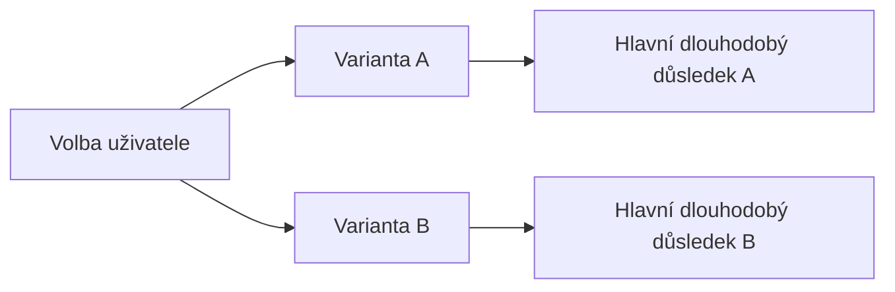

# Rozhodnutí: Srozumitelná otázka zaměřená na výsledek

## Proč je rozhodnutí potřeba

Jednoduše vysvětli, co se po volbě změní pro uživatele, projekt nebo dlouhodobý provoz.

Nevysvětluj nejdříve interní technologii.

Uveď, proč tuto preferenci nemůže AI bezpečně odvodit z přijatých požadavků.

## Co už je pevně dané

- `<kanonický požadavek nebo omezení>`
- `<nepřijatelný důsledek>`
- `<časová nebo migrační podmínka>`

## Reálně vhodné varianty

| Varianta | Jednoduchý význam | Hlavní přínos | Hlavní nevýhoda | Dlouhodobý důsledek | Migrace | Vratnost |
|---|---|---|---|---|---|---|
| **A — <název podle výsledku>** | `<co uživatel získá>` | `<největší přínos>` | `<největší cena>` | `<údržba, provoz nebo směr>` | `<nízká, střední nebo vysoká>` | `<snadná, řízená nebo obtížná>` |
| **B — <název podle výsledku>** | `<co uživatel získá>` | `<největší přínos>` | `<největší cena>` | `<údržba, provoz nebo směr>` | `<nízká, střední nebo vysoká>` | `<snadná, řízená nebo obtížná>` |

Přidej třetí nebo čtvrtou variantu pouze tehdy, když je po výzkumu skutečně vhodná.

Nevkládej záměrně slabou variantu pro vytvoření zdání volby.

## Doporučení AI

**Doporučená varianta:** `<A nebo B>`

Doporučení vysvětli nejvýše několika větami.

Každou větu napiš jako samostatný odstavec oddělený právě jedním prázdným řádkem podle [kanonického stylu Markdownu](../governance/documentation.md#styl-markdownu).

Uveď nejdůležitější důkaz, kompromis a podmínku, při které by byla lepší jiná varianta.

## Vizuální srovnání

Mermaid použij pouze tehdy, když vztahy nebo následky nejsou z tabulky rychle zřejmé.

Diagram nesmí být jediným popisem variant.



## Co AI rozhodne po této volbě samostatně

- `<implementační detail>`
- `<testovací detail>`
- `<lokální struktura v přijaté architektuře>`

## Jak odpovědět

Uživatel může odpovědět pouze identifikátorem varianty a případnou podmínkou.

```text
Volím A.
Podmínka: <volitelné upřesnění>.
```

## Zápis výsledku

Po odpovědi zapiš produktovou volbu do kanonických požadavků nebo technickou volbu do ADR.

V pracovním záznamu ponech pouze odkaz a úkolový dopad.
