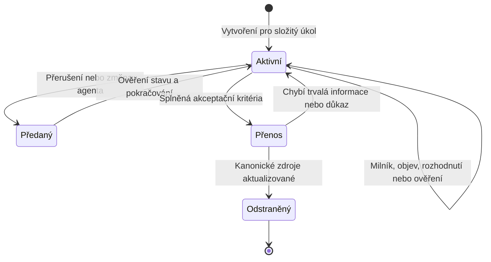

# Dočasné pracovní záznamy

## Účel

Složitý nebo dlouhý úkol používá jeden verzovaný pracovní záznam.

Záznam umožňuje jinému AI agentovi nebo uživateli bezpečně pokračovat po ztrátě kontextu, přerušení nebo předání.

Není archivem trvalých projektových znalostí.

Po dokončení se jeho trvalé závěry přesunou do kanonických dokumentů a soubor se odstraní.

Aktivní práce se zjišťuje přímo podle souborů odpovídajících:

```text
docs/work/WORK-*.md
```

Nevytvářej samostatný soubor `current.md` ani ručně udržovaný seznam aktivních úkolů.

Takový seznam by duplikoval stav souborového systému.

## Kdy záznam vytvořit

Pracovní záznam je povinný, pokud úkol splňuje alespoň jednu podmínku:

- zasahuje více modulů, služeb nebo vrstev,
- mění architekturu, veřejné API, data, CI, nasazení nebo bezpečnost,
- obsahuje migraci, významný refaktoring nebo více ověřitelných milníků,
- pravděpodobně překročí jedno kontextové okno nebo pracovní relaci,
- vyžaduje rozsáhlejší průzkum nebo experiment,
- obsahuje blokující uživatelská rozhodnutí,
- má vysoké riziko ztráty, výpadku nebo obtížného návratu,
- může jej převzít jiný agent,
- baseline již obsahuje nejasná selhání nebo rozpory.

Jednoduchá lokální změna s jednoznačným řešením samostatný záznam nepotřebuje.

Záznam se nevytváří mechanicky pro každý commit.

## Název

Použij formát:

```text
docs/work/WORK-<stabilní-id>-<stručný-popis>.md
```

Příklady:

```text
docs/work/WORK-142-migrace-prihlaseni.md
docs/work/WORK-ADR-0007-zmena-fronty.md
docs/work/WORK-20260828-obnova-ci.md
```

Stabilní identifikátor použij z issue trackeru, pokud existuje.

Jeden úkol má právě jeden pracovní záznam.

Nevytvářej zvlášť plán, deník, handoff a seznam rozhodnutí.

Šablona je sjednocuje, aby se stav neduplikoval.

## Vytvoření

Zkopíruj [`../templates/work-record.md`](../templates/work-record.md) do nového souboru.

Vyplň známý výsledek, akceptační kritéria, omezení, orientaci, baseline a první milníky dříve, než začne rozsáhlá editace.

Neopisuj stabilní architekturu ani požadavky.

Odkazuj na kanonické dokumenty a přidej pouze úkolově specifický význam.

Pracovní záznam commituj na větvi `develop` spolu s prvním ověřitelným milníkem nebo dříve, pokud je nutné předání.

Citlivé údaje, tajemství a neveřejná produkční data do něj nepatří.

## Průběžná aktualizace

Záznam aktualizuj:

- po dokončení každého milníku,
- po změně plánu,
- po objevení překvapivého chování nebo nového rizika,
- po přijetí rozhodnutí,
- po důležitém experimentu,
- před přerušením nebo předáním,
- před rizikovou změnou, pokud musí být známý bezpečný návrat,
- po každém ověření, které mění důvěru ve výsledek.

Položku nikdy neoznačuj jako dokončenou pouze podle provedené editace.

Doplněný důkaz musí potvrdit její akceptační podmínku.

Neúspěšný pokus se zaznamená, pokud jeho opakování hrozí nebo změnil další postup.

## Bezpečné pokračování

Nový agent před změnami:

1. přečte celý pracovní záznam,
2. načte všechny odkazované kanonické dokumenty,
3. ověří pracovní větev a Git stav,
4. porovná poslední uvedený commit se skutečnou historií,
5. spustí nejkratší uvedený smoke nebo stavový příkaz,
6. potvrdí, že první nedokončený milník je stále správný,
7. pokračuje přesně z položky „Další bezpečný krok“.

Pokud skutečný stav nesouhlasí se záznamem, agent nejdříve zjišťuje příčinu.

Záznam nepřepíše odhadem tak, aby rozpor zmizel.

## Více souběžných úkolů

Každý úkol má vlastní soubor.

Agent přečte názvy všech aktivních souborů a plný obsah pouze těch, které mohou zasahovat stejnou oblast.

Při překryvu změn se nejdříve určí společné hranice, pořadí a riziko.

Dva agenti nesmějí nezávisle přijmout dvě odlišné normativní změny stejné oblasti.

## Dokončení a odstranění

Před odstraněním záznamu proveď kontrolu přenosu znalostí.

- Produktové změny jsou v kanonických požadavcích.
- Architektonické změny jsou v architektonickém přehledu.
- Významná rozhodnutí jsou v ADR.
- Přesné podporované příkazy jsou v dokumentu příkazů.
- Testovací nebo CI změny jsou ve svých kanonických dokumentech.
- Provozní poznatky jsou v runbooku.
- Přechodové stavy mají vlastníka a podmínku ukončení.
- Výsledek je ověřený a zbývající rizika jsou viditelná.

Poté pracovní záznam odstraň ve stejné změně, která úkol dokončuje.

Dokončené záznamy se nepřesouvají do archivního adresáře.

Git historie uchovává auditní stopu bez znečištění aktivního kontextu.

## Životní cyklus



Diagram ukazuje životní cyklus.

Podmínky jednotlivých přechodů jsou závazně definované v textu.
