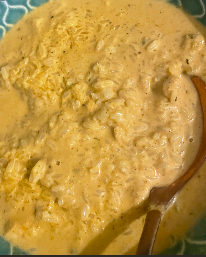

## Kuřecí na kari s rýží

Ingredience

- Rýže 250g
- Máslo
- Kuřecí prsa 400 g
- 1 ks cibule
- Čerstvý zázvor  10g
- 2 stroužky česneku
- Kokosové mléko 400 ml
- Mango/Broskev 1 ks
- Koriandr
- Voda
- Kurkuma
- Sůl
- Pepř
- Sladká paprika koření
- Guláš koření
- Kari koření
- Bazalka koření

Postup

1. Na pánvi máslo, na kterém orestujeme nadrobno nakrájenou cibuli s česnekem a zázvorem.
2. Orestovanou cibuli s česnekem a zázvorem vložíme do mixéru. 
3. Přidáme nakrájené mango/broskev, kokosové mléko a veškeré koření. 

    Celou směs rozmixujeme dohladka.
4. Omáčku přelijeme na pánev a přidáme do ní na kostičky nakrájené kuřecí maso a trochu vody.
5. Vaříme přibližně 20 minut, dokud se maso neuvaří.
6. Můžeme podávat s rýží a posypat nasekaným koriandrem.

